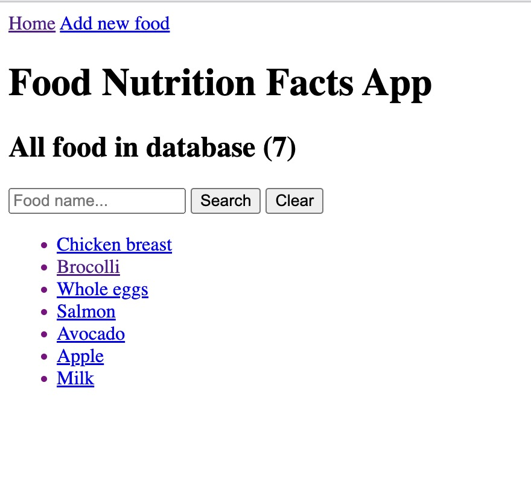
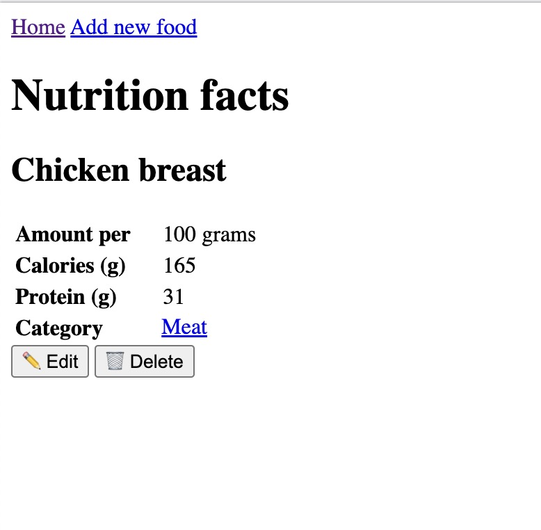
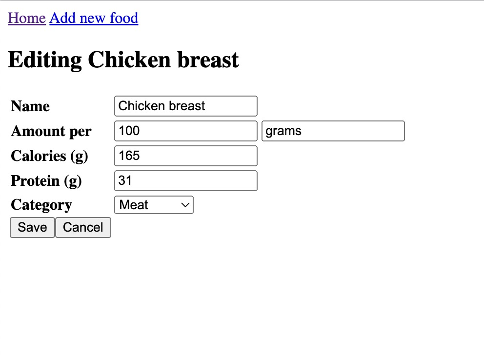

# Food Nutrition App

A simple, typical CRUD app for food nutrition. Built with Svelte + Express + Mongoose

## Functions

| Screen | Screenshot |
| ----------- | ----------- |
| Home |  |
| Details |  |
| Edit food |  |


## Running

From the project folder, run these commands:

```bash
# install dependencies
yarn run install

# start mongod service
yarn run start:db

# start both server and client
yarn run start
```

Check out `package.json` for other scripts
