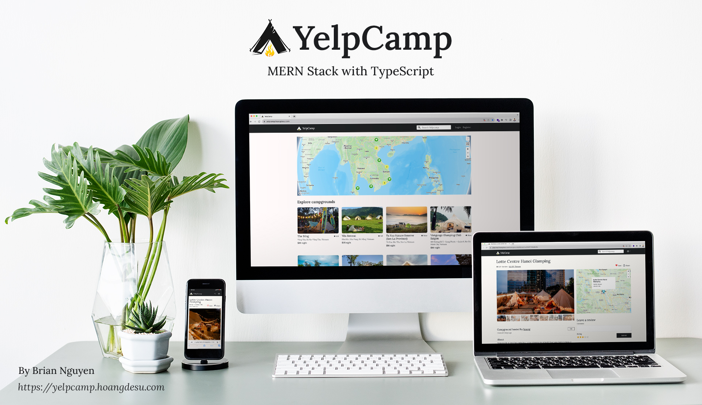

# YelpCamp - MERN stack with TypeScript



## Table of Contents

-   [About](#about)
-   [Installation](#installation)
    -   [Running](#running)
    -   [Running with Docker:](#running-with-docker)
-   [Technologies](#technologies) - [Frontend](#frontend) - [Backend](#backend) -
    [Third-party APIs](#third-party-apis)
-   [Installation](#installation-1) - [Running locally](#running-locally) -
    [Running with Docker](#running-with-docker-1)
-   [Functionalities](#functionalities)
-   [How To](#how-to)
    -   [How to add a new campground?](#how-to-add-a-new-campground)
-   [Reflection?](#reflection)
-   [Connect with me](#connect-with-me)

## About

YelpCamp is the final project from Colt Steele's course on Udemy
[The Web Developer Bootcamp](https://www.udemy.com/course/the-web-developer-bootcamp/). It's a
fullstack web application for browsing and sharing camping sites around the world.

Originally the app from the course is server-side rendered using Node and EJS template engine.
However, I wanted to make something that I can proudly call "my own", not "just another YelpCamp
project", so I completely re-designed the app and built it using the MERN stack with TypeScript for
the client-side. Beside the typical CRUD operations, I also implemented a bunch of extra features
like making reservations, user profile, simulated mobile payment with QR code, etc.

## Technologies


##### Frontend

The frontend is written in [React 18](https://github.com/facebook/react) , with the following
additional libraries:

-   [@bitjson/qr-code](https://github.com/bitjson/qr-code): web-component QR code generator for
    simulated mobile payment
-   [axios](https://github.com/axios/axios): promise based HTTP client
-   [react-grid-dnd](https://github.com/bmcmahen/react-grid-dnd): for drag and drop images in New
    Campground and Edit Campground pages
-   [react-query (v3)](https://tanstack.com/query/v3/): powerful asynchronous state management,
    server-state utilities and data fetching library
-   [react-router (v6)](https://reactrouter.com/en/main): client side routing library

Multiple <span classname="font-medium">UI libraries</span> are combined for the sake of learning and
utilizing component customization:

-   [React Bootstrap](https://react-bootstrap.netlify.app/)
-   [styled-components](https://styled-components.com/)
-   [Material UI](https://mui.com/)
-   [Tailwind CSS](https://tailwindcss.com/)

##### Backend

The backend is powered [Express](https://expressjs.com/) - a fast, unopinionated, minimalist web
framework for [Node.js](https://nodejs.org/en) .  
Additional libraries include:

-   <a href="" target="_blank">mongoose</a>: Object Data Modeling library for MongoDB and Node.js
-   [express-session](https://github.com/expressjs/session): session middleware, paired with
    [connect-mongo](https://github.com/jdesboeufs/connect-mongo) to store session in MongoDB
-   [Passport](https://github.com/jaredhanson/passport): authentication middleware, paired with
    [Local Strategy](https://github.com/jaredhanson/passport-local) and
    [Passport Local Mongoose](https://github.com/saintedlama/passport-local-mongoose)
-   [Multer](https://github.com/expressjs/multer) and
    [multer-storage-cloudinary](https://github.com/affanshahid/multer-storage-cloudinary):
    middleware for handling uploading images to Cloudinary
-   [morgan](https://github.com/expressjs/morgan): HTTP request logger middleware
-   [helmet](https://github.com/helmetjs/helmet): help secure Express apps with various HTTP headers
-   [joi](https://github.com/hapijs/joi): data validation library
-   [sanitize-html](https://github.com/apostrophecms/sanitize-html): HTML sanitizer for enhanced
    security

##### Third-party APIs

-   [Mapbox](https://www.mapbox.com/): client APIs and server SDKs for map geolocation and geocoding
    services
-   [Cloudinary](https://cloudinary.com/): image storage service

## Installation

### Running

Installation

Install `yarn`

From this folder, run the following commands:

```
yarn
yarn run install:all
yarn run start:db
yarn start
```

### Running with Docker:

Images are pre-built and available on Dockerhub

-   https://hub.docker.com/r/hoangdesu/yelpcamp-mern-server
-   https://hub.docker.com/r/hoangdesu/yelpcamp-mern-client

From YelpCamp folder, run the following command to pull images and start the container:

```
docker compose up -d
```

</div>

<div classname="mt-4">

## Installation

### Running locally

Clone the project:  
`$ git clone https://github.com/hoangdesu/web-developer-bootcamp.git`

From the `web-developer-bootcamp` folder, navigate to YelpCamp directory:  
`$ cd YelpCamp`

Install [yarn](https://classic.yarnpkg.com/en/) (optional):  
`$ npm install --global yarn`

Run the following commands to install dependencies:  
`$ yarn`  
`$ yarn run install:all`

Install
[MongoDB Community Edition](https://www.mongodb.com/docs/manual/administration/install-community/) .
Start database:  
`$ yarn run start:db`

Start all services:  
`$ yarn run start:all:dev`

🚀 Frontend will be available at [http://localhost:5173](http://localhost:5173) , backend at
[http://localhost:3001](http://localhost:3001)

##### Running with Docker

Install [Docker](https://www.docker.com/) . Make sure Docker daemon is running.

Images are pre-built and available on Dockerhub:

-   [yelpcamp-mern-server](https://hub.docker.com/r/hoangdesu/yelpcamp-mern-server)
-   [yelpcamp-mern-client](https://hub.docker.com/r/hoangdesu/yelpcamp-mern-client)

Pull the images and start the container:

`$ docker compose up -d`</div>

<div classname="mt-4">

## Functionalities

<div classname="flex flex-wrap"><aboutimagecontainer image="{Home}" description="{'something'}"><aboutimagecontainer image="{Campground}" description="{'campground'}"><aboutimagecontainer image="{Home}" description="{'something'}"><aboutimagecontainer image="{Home}" description="{'something'}"></aboutimagecontainer></aboutimagecontainer></aboutimagecontainer></aboutimagecontainer></div>

</div>

...

<div classname="mt-4">

## How To

### How to add a new campground?

</div>

## Reflection?

<div>

## Connect with me

-   [Personal website](https://hoangdesu.com/) _ [LinkedIn](https://www.linkedin.com/in/hoangdesu/)
    _ [Facebook](https://www.facebook.com/Hoangdayo/) _
    [Instagram](https://www.instagram.com/hoang.desu/) _ [Github](https://github.com/hoangdesu) \*
    [Email](mailto:hoangdesu@gmail.com)</div>

</div>

<div classname="sticky top-10 right-0 float-right">
