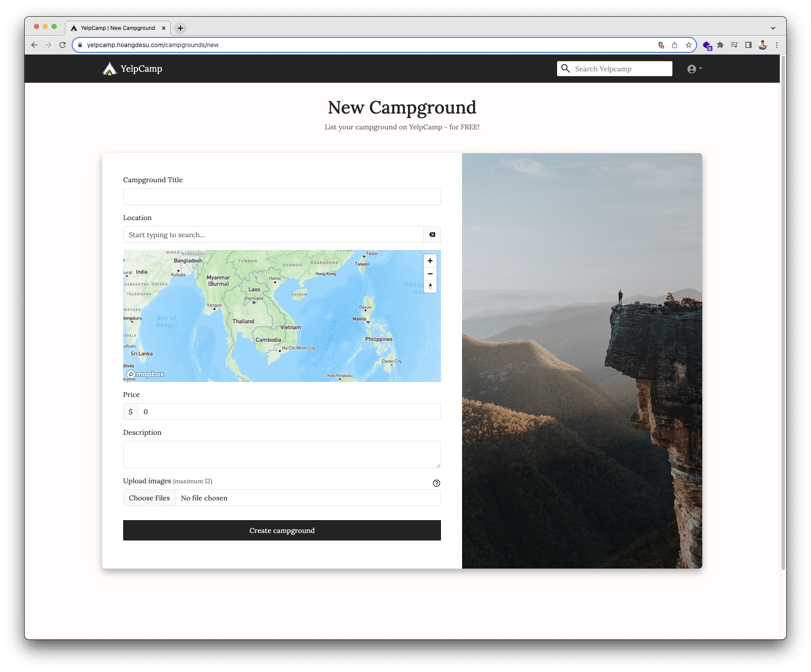

<!-- omit in toc -->
# YelpCamp - MERN stack with TypeScript


<p style="text-align: center;">
  <a href="https://yelpcamp.hoangdesu.com/">🌐 https://yelpcamp.hoangdesu.com/</a> 
</p>

<!-- omit in toc -->
## Table of Contents

- [About](#about)
- [Technologies](#technologies)
  - [Frontend](#frontend)
  - [Backend](#backend)
  - [Third-party APIs](#third-party-apis)
- [Installation](#installation)
  - [Running locally](#running-locally)
  - [Running with Docker](#running-with-docker)
- [Features and app preview](#features-and-app-preview)
- [Video demo...](#video-demo)

## About

YelpCamp is the final project from Colt Steele's course on Udemy
[The Web Developer Bootcamp](https://www.udemy.com/course/the-web-developer-bootcamp/). It's a
fullstack web application for browsing and sharing camping sites around the world.

Originally the app from the course is server-side rendered using Node and EJS template engine.
However, I wanted to make something that I can proudly call "my own", not "just another YelpCamp
project", so I completely re-designed the app and built it using the MERN stack with TypeScript for
the client-side. Beside the typical CRUD operations, I also implemented a bunch of extra features
like making reservations, user profile, simulated mobile payment with QR code, etc.

## Technologies


### Frontend

The frontend is written in [React 18](https://github.com/facebook/react) using [TypeScript](https://www.typescriptlang.org/), with the following
additional libraries:

-   [@bitjson/qr-code](https://github.com/bitjson/qr-code): web-component QR code generator for
    simulated mobile payment
-   [axios](https://github.com/axios/axios): promise based HTTP client
-   [react-grid-dnd](https://github.com/bmcmahen/react-grid-dnd): for drag and drop images in New
    Campground and Edit Campground pages
-   [react-query (v3)](https://tanstack.com/query/v3/): powerful asynchronous state management,
    server-state utilities and data fetching library
-   [react-router (v6)](https://reactrouter.com/en/main): client side routing library

Multiple UI libraries are combined for the sake of learning and utilizing component customization:

-   [React Bootstrap](https://react-bootstrap.netlify.app/)
-   [styled-components](https://styled-components.com/)
-   [Material UI](https://mui.com/)
-   [Tailwind CSS](https://tailwindcss.com/)

### Backend

The backend is powered by [Express](https://expressjs.com/) - a fast, unopinionated, minimalist web
framework for [Node.js](https://nodejs.org/en).  
Additional libraries include:

-   [mongoose](https://mongoosejs.com/): Object Data Modeling library for MongoDB and Node.js
-   [express-session](https://github.com/expressjs/session): session middleware, paired with
    [connect-mongo](https://github.com/jdesboeufs/connect-mongo) to store session in MongoDB
-   [Passport](https://github.com/jaredhanson/passport): authentication middleware, paired with
    [Local Strategy](https://github.com/jaredhanson/passport-local) and
    [Passport Local Mongoose](https://github.com/saintedlama/passport-local-mongoose)
-   [Multer](https://github.com/expressjs/multer) and
    [multer-storage-cloudinary](https://github.com/affanshahid/multer-storage-cloudinary):
    middleware for handling uploading images to Cloudinary
-   [morgan](https://github.com/expressjs/morgan): HTTP request logger middleware
-   [helmet](https://github.com/helmetjs/helmet): help secure Express apps with various HTTP headers
-   [joi](https://github.com/hapijs/joi): data validation library
-   [sanitize-html](https://github.com/apostrophecms/sanitize-html): HTML sanitizer for enhanced
    security

### Third-party APIs

-   [Mapbox](https://www.mapbox.com/): client APIs and server SDKs for map geolocation and geocoding
    services
-   [Cloudinary](https://cloudinary.com/): image storage service

## Installation

### Running locally

Clone the project:

```
$ git clone https://github.com/hoangdesu/web-developer-bootcamp.git
```

From the `web-developer-bootcamp` folder, navigate to YelpCamp directory:

```
$ cd YelpCamp
```

Install [yarn](https://classic.yarnpkg.com/en/) (optional):

```
$ npm install --global yarn
```

Run the following commands to install dependencies:

```
$ yarn
$ yarn run install:all
```

Install
[MongoDB Community Edition](https://www.mongodb.com/docs/manual/administration/install-community/).
Start the database:

```
$ yarn run start:db
```

Start all services:

```
$ yarn run start:all:dev
```

🚀 Frontend will be available at [http://localhost:5173](http://localhost:5173), backend at
[http://localhost:3001](http://localhost:3001)

### Running with Docker

Install [Docker](https://www.docker.com/). Make sure Docker daemon is running.

Images are pre-built and available on Dockerhub:

-   [yelpcamp-mern-server](https://hub.docker.com/r/hoangdesu/yelpcamp-mern-server)
-   [yelpcamp-mern-client](https://hub.docker.com/r/hoangdesu/yelpcamp-mern-client)

Pull the images and start the container:

```
$ docker compose up -d
```

## Features and app preview

This app is fully responsive and mobile-friendly. Some components are designed differently to work best with their current view. 

| Features | Desktop view | Mobile view |
| ----------- | ----------- | ----------- |
| Homepage: browse campgrounds, clustered map view |  |  |
| View campground: add to favorite, leave a review, make reservations |  |  |
| Add new campground: location auto suggestion, images drag and drop |  |  |
| Edit or delete campground |  |  |
| Search and filtering |  |  |
| Make reservation, checkout |  |  |
| User dashboard: update account, manage owned and favorite campgrounds, view all reservations |  |  |


## Video demo

[](https://youtu.be/05fs2Pxwnj4 "YelpCamp demo")
